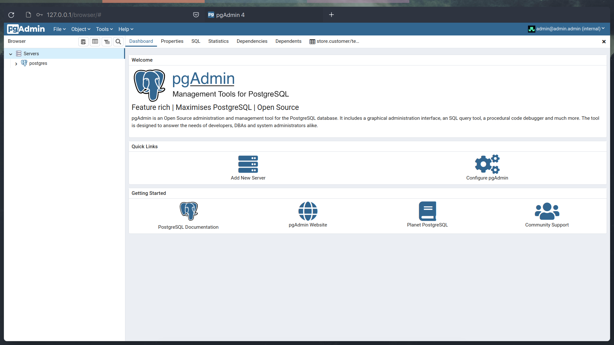

# 04.10.2022 - C & C++ / Về gcc và g++.

Nếu đều gõ `man gcc` và `man g++`, bạn đều thấy đều trỏ về 1 page với tiêu đề:

> gcc - GNU project C and C++ compiler


Vậy thì khác biệt ở 2 giữa chúng là gì? Cơ bản nhất, `gcc` sử dụng để biên dịch các file `.c`, ngược lại với `g++` sẽ biên dịch các file `.cpp`. Thực tế, có thể dùng cả 2 trình biên dịch cho cả 2 ngôn ngữ, tuy nhiên vẫn có sự khác biệt: `g++` nếu biên dịch file `c` sẽ vẫn coi nó là file `cpp` bình thường, còn `gcc` sẽ coi `c` và `cpp` là riêng biệt.

Ngoài ra, cái khác biệt nhất mà mình muốn đề cập đến:

| `gcc`                                                                                     | `g++`                   |
| ----------------------------------------------------------------------------------------- | ----------------------- |
| Using `g++` to link the object files, files automatically links in the std C++ libraries. | `gcc` does not do this. |
                                                                                                               
Ví dụ cho khác biệt trên là thư viện `math.h`, ví dụ với đoạn code `c` sau:

```c
#include <math.h>

int isPrime(int number) {
    if (number <= 1) {
        return 0;
    }
    double sqrtOfNumber = sqrt(number); 
    for (int i = 2; i < sqrtOfNumber; i++) {
        if (number % i == 0) {  
            return 0;
        }
    }
    return 1;
}

```

Sử dụng câu lệnh `gcc main.c -o main`, `gcc` sẽ vả vào mặt bạn với lỗi sau:

```bash
/usr/bin/ld: /tmp/cccVnyTo.o: in function `isPrime':
main.c:(.main+0x5a): undefined reference to `sqrt'
```

Tuy nhiên, nếu biên dịch lại với `g++`, vẫn câu lệnh có cú pháp trên: `g++ main.c -o main`, chương trình sẽ chạy ngon ơ. 

Khác biệt ở đây chính thư viện `math.h` không được link 1 cách tự động khi sử dụng `gcc`, ngược lại với `g++`. Nên nếu muốn sử dụng `gcc` để biên dịch, bạn cần thêm arg `-lm` để **l**ink các thư viện **m**aths. 

```bash
$ gcc main.c -o main -lm
```

### Bonus

Có thể coi `g++` tương đương với `gcc -xc++ -lstdc++ -shared-libgcc`.

### References

+ https://stackoverflow.com/questions/172587/what-is-the-difference-between-g-and-gcc
+ https://stackoverflow.com/questions/19372317/c-failing-to-compile-cant-find-math-h-functions
+ https://www.geeksforgeeks.org/difference-between-gcc-and-g/

# 04.09.2022 - Docker/run pgAdmin4 on Docker in Arch Linux.
	
[pgAdmin4](https://www.pgadmin.org/download/) là GUI cho postgreSQL - dbms mình sẽ học cho học phần Database ở đại học. Nó là web application được build dựa trên `python` và `Javascript/jQuery`. Việc cài đặt trên Linux rất đơn giản, với Arch linux:

```bash
$ yay -S pgadmin4
```

Nhưng app build dựa trên python, nên packages python đi kèm nó rất nhiều:

```
Packages (35): python-alembic-1.7.4-3  python-blinker-1.4-11  python-   		               brotli-1.0.9-7  python-dateutil-2.8.2-4  python-editor-                 1.0.4-8  python-email-validator-1.1.3-3
              python-extras-1.0.0-10  python-fixtures-3.0.0-12  python-         flask-babelex-0.9.4-5  python-flask-compress-1.11-1               python-flask-gravatar-0.5.0-7  python-flask-login-0.6.0-1
              python-flask-mail-0.9.1-8  python-flask-migrate-3.0.0-3  python-flask-paranoid-0.2-8  python-flask-principal-0.4.0-8  python-flask-security-too-4.1.3-1
              python-flask-sqlalchemy-2.5.1-3  python-flask-wtf-1.0.0-1         python-gssapi-1.7.3-1  python-ldap3-2.9.1-3  python-paramiko-2.9.2-1  python-passlib-1.7.4-5  python-pbr-5.8.1-1
              python-psycopg2-2.9.3-1  python-pyasn1-0.4.8-7  python-pynacl-1.4.0-5  python-simplejson-3.17.6-3  python-speaklater-1.3-11  python-sqlalchemy1.3-1.3.24-5
              python-sqlparse-0.4.2-3  python-sshtunnel-0.4.0-3  python-testtools-2.5.0-3  python-wtforms-3.0.1-1  pgadmin4-4.30-3

Total Installed Size:  153,29 MiB
```

Thực tế thì khi tải xong, mình cũng gặp lỗi không thể sử dụng được :v, có thể đống package trên conflict version với python đâu đó trong máy của mình. Nhưng nói chung là rất nhiều lỗi vặt tùm lum, fix cái này lại lòi ra cái khác. 

Xem lại trên fanpage của họ thì thấy có trên [Docker](https://hub.docker.com/r/dpage/pgadmin4/), quá tiện luôn, vừa để thực hành docker gần đây học :v.

### Setup

+ Đầu tiên, pull image đó về: `docker pull dpage/pgadmin4`.
+ Trước khi run, cần lưu ý 2 cái **environment variable** của pgAdmin là `PGADMIN_DEFAULT_EMAIL` và `PGADMIN_DEFAULT_PASSWORD` để đăng nhập vào web app lúc deploy. Nên mình phải dùng flag `-e` để set trước cho nó. Tiếp theo, vì là web app, nên cần set `--network="host"` để host trong docker container chung host  với host machine (là máy của mình). 

    ```bash
	$ docker run --name pgadmin --network="host" -e 	"PGADMIN_DEFAULT_EMAIL=admin@admin.admin" -e "PGADMIN_DEFAULT_PASSWORD=admin" -d dpage/pgadmin4
	```

+ Giờ thì mở browser lên và truy cập url 127.0.0.1 thui :v. Đăng nhập với mail và pass mình set ở trên. 

*Tèn ten*


Thật ra cũng chả phải là gì to tát cả, nhưng việc ứng dụng được `docker` - 1 tools mới để hoàn thành công việc, làm mình thấy rất vui :)).

Mình viết thêm đoạn script nhỏ để phần setup đầy đủ hơn, từ việc run để việc mở browser. Link [gist đây](https://gist.github.com/betty2310/bac29054f38f4a4614f250bbc8eeca39).

### References

+ https://docs.docker.com/engine/reference/run/
+ https://www.pgadmin.org/docs/pgadmin4/latest/container_deployment.html
+ https://www.metricfire.com/blog/what-is-docker-network-host/

# 04.01.2022 - Tâm sự/Cá tháng 4, chuyện học hành, thực tập, tương lai. 

## Thực tập, job fair và tiếng Nhật
Cá tháng 4, các mẩu chuyện mình đọc và biết hôm nay đều như trò đùa với tâm trí của bản thân mình vậy :v. Thật là tụt mood hôm nay mà. 

Từ những câu truyện bên lề như có 1 cô gái nọ vì tình yêu mà đốt nhà người ta, hay 1 em trai mới lớp 10 đã tự từ vì áp lực học tập. 

Hay cả câu truyện tương lai, nghề nghiệp của chính bản thân. 

Mình không phải là người thông minh, mình tự nhận như vậy và luôn cảm thấy như vậy. Nhưng mình vẫn đạt được 2 lần học bổng từ trường đại học mang tiếng là khó lắm cơ mà, ấy là vì mình chăm chỉ - thứ mình cảm thấy "oh, chắc là điểm mạnh của mình đấy :v". Phải, mình không tự tin là thônng minh nhưng có thể khẳng định chăm chỉ, cần cù thì có thừa. 

Điều ấy được minh chứng rõ ràng qua 2 cái học bổng mình vừa kể trên. Cơ mà ngay trong kì 3 học online vừa rồi, cái thứ mình tự hào nhất vừa nãy cũng không còn nữa. Nguyên nhân thì mình chưa muốn đề cập đến (mình có nhiều lý do lắm :v, kể cả để đổ lỗi hay từ chính bản thân), nên là học hành - và ở đây mình muốn nói đến tiếng Nhật của bản thân, đã chững lại, không phát triển được gì thêm trong 1 quãng dài.


 
Điều này ảnh hưởng nhiều đến tâm lý, và suy nghĩ của mình đến kì job fair vào đầu năm 3 của mình chứ. Liệu có như ý không nhỉ? mình đọc được rằng nếu đầu năm 3 có job fair, mình nên có kinh nghiệm thực tập vào tầm năm 2 như này, nhưng cơ hội của mình đã qua trong khi mình rõ ràng có khả năng nắm lấy. Haizzz.
 
Mình lại thấy nhiều người giỏi của chính ngành IT-E6, những người mình ngưỡng mộ thật sự và đương nhiên có 1 chút ghen tỵ từ họ. Vừa học giỏi, nhiều bạn bè, thầy cô nữa chứ. Haizzzzz. 

Còn 1 chuyện nữa, đến cả hôm nay lên thư viện - nới mình luôn thích nhất, thì cũng ăn cơm chó đến no cả bữa trưa :v. Đúng là ngày buồn :v

À mà hôm nay trời cũng mưa đấy, mỗi lần mưa lại nhớ đến bạn hồi lớp 9, chán thật. 

Quả là ngày như kiểu mọi kiểu nỗi buồn đổ hết vào đầu. 

## でも、
 
Vượt lên thôi chứ sao :v, gì chứ những điều trước đây mình luôn nghĩ là khó, bất khả thi thì mình lại càng cố gắng và muốn đạt được nó như việc đỗ vào được HUST này, được học bổng này :v. Vậy nên than thở đến đây thôi!
 
Thật ra viết được hết những tâm sự này đã là 1 thành công lớn rồi, âu nó cũng giải tỏa cho chính bản thân mình 1 chút vấn đề. Chắc là chưa ai đọc blog của mình đâu :v. Bản thân mình bây giờ gần như chẳng có ai để chia sẻ vấn đề tâm lý cá nhân, nhiều khi dồn nén lại rồi cảm thấy khó chịu - đây có thể là giải pháp tốt hiện giờ. 

Còn bây giờ, mình vẫn đang xem bốc thăm vòng chung kết World Cup 2022. 
 
 
# 03.31.2022 - Computer Architecture/Keyboard buffer...

### Buffer
Một vùng đệm, something like một vùng ảo, temp :v. 

### Keyboard buffer 
Khi ta tương tác với bàn phím, những phím mình gõ không được gửi thẳng trực tiếp đến bộ xử lý của máy tính ngay, mà nó được gửi vào 1 vùng buffer để lưu giữ các keystrokes này lại, sau 1 số bước xử lý mới send vào cpu. Vùng buffer nằm trên RAM, dung lượng rất nhỏ.

### Yeah what it do and why exits?
Vậy thì mình tự hỏi, sao phải vẽ ra cái buffer này để làm gì nhỉ? Trước hết thì:

+ Giúp mình có thể control được các tổ hợp phím. Giả sử như `control + shift + Esc` để mở Task manager (trên Window) chẳng hạn. Buffer cho cpu 1 quãng nghỉ để đợi các chuỗi phím được hoàn thành hết, rồi mới xử lý. 
+ Lỡ đâu mình bấm nhanh quá, Cpu còn không kịp xử lý mình bấm cái gì thì sao :v, buffer cũng giải quyết vấn đề này. 
+ Mình nghĩ được thế này thôi :((.

### Buffer in Programming language 
Trong ngôn ngữ `C`, sử dụng các hàm đọc dữ liệu từ bàn phím như `scanf` , tưởng rằng như nó đọc trực tiếp: ta bấm gì thì nó đọc đấy, nhưng thật ra nó chỉ đọc qua buffer mà thôi.
Việc kiểm soát các ký tự trong buffer lúc này rất là important, giả sử như các phím ta bấm nhưng `scanf` không đọc hết, nó sẽ còn thừa 1 số kí tự trong buffer, và sẽ ảnh hưởng đến các lần đọc input từ bàn phím tiếp theo.

Xét 1 cái ví dụ nhỉ. 1 đoạn code `C` như sau:

```c++
int n;
scanf("%d" &n);
char c;
getchar(c);
```

Mình nghĩ `c` sẽ có giá trị là gì?
Khi nhập giá trị cho `n`, đúng như những gì ta gõ trên bàn phím, sẽ là 1 loạt các số (muốn gán cho `n`) và phím `Enter` nữa :v. Vậy trong buffer bây giờ ta có các số và `\n` ở cuối buffer. Hàm `scanf` với format `%d` sẽ đọc các số và dừng lại khi gặp ký tự `\n` (see [**Whitespace character**](https://www.cplusplus.com/reference/cstdio/scanf/)). Vậy lúc này trong buffer còn 1 ký tự là `\n`. Tiếp theo là `getchar()`, tưởng rằng ta sẽ lại nhập 1 ký tự từ bàn phím và gán nó cho biến `c`. Nhưng `getChar()` đọc 1 ký tự từ buffer, và đó là `\n`, nên nó đọc và gán luôn giá trị này cho `c`, đến đây dễ thấy ta đã gặp lỗi. 

Nhớ chú ý vấn đề này nha.

### Vễ dữ liệu đầu vào, đầu ra và virus, hack.

Như 1 [thầy giáo](https://soict.hust.edu.vn/ths-nguyen-duc-tien.html) mà mình yêu quí đề cập trong giờ học. Các thiết bị như bàn phím, máy in, máy đọc vân tay hay QR đưa dữ liệu mà chúng đọc được vào máy tính chả khác gì nhau cả, hãy đều coi chúng là 1 cái bàn phím và ta đều dùng hàm `scanf()` để đọc dữ liệu từ chúng. 
Vậy thì hãy hiểu rõ việc control buffer này. Nó như 1 cửa ngõ để chui vào cpu. Và các virus hay hacker sẽ luôn muốn phá cái cửa ngõ này để hack máy tính của chúng ta (giống việc lan truyền covid 19 ở cái cửa ra vào lớp :v).

# 03.29.2022 - Docker/Tutorial nào!!!!

Sắp tới mình sẽ học môn Cơ sở dữ liệu, nghe nói sẽ được tiếp xúc với MySQL các thứ các thứ :v. Thực ra đến giờ mình vẫn chả biết gì đâu, nhưng hiện tại mình đang dùng `OS` chính là `Arch Linux` (yeah, I use Arch btw), trong khi MySql chỉ chạy được trên `win` thôi, mà mình lại từng nghe qua [Docker](https://www.docker.com/) sẽ giải quyết được vấn đề này. Nên mình tiện đây sẽ tìm hiểu về Docker luôn!

Hôm nay sẽ chỉ nói về cách download Docker và setup chuẩn chỉ thôi nhỉ (vì chưa tìm hiểu được j nhiều :v). 

Dùng package manager của Os linux mà tải thôi. Như trên Arch thì: `sudo pacman -S docker` hoặc chơi bản dev thì tải bản git qua AUR `yay -S docker-git`. 

Chạy docker và autostartup:

---

```bash
$ systemctl start docker.service
$ systemctl enable docker.service
```

Check version và xem có ok không bằng `docker info` nào!!
Docker cần chạy với quyền `root`, nên nếu run ngay `docker info` thì sẽ bị permission denied. 

```bash
$ docker info
Client:
 Context:    default
 Debug Mode: false
 Plugins:
  buildx: Docker Buildx (Docker Inc., v0.8.1-docker)

Server:
ERROR: Got permission denied while trying to connect to the Docker daemon socket at unix:///var/run/docker.sock: Get "http://%2Fvar%2Frun%2Fdocker.sock/v1.24/info": dial unix /var/run/docker.sock: connect: permission denied
errors pretty printing info
```

Đơn giản nhất thì tạo 1 cái group docker rồi add nó vào cho user thôi. 

```bash
$ groupadd docker 
$ gpasswd -a %USERNAME docker
```

Done! và như bao thứ khác từ khi mình dấn thân vào con đường gõ phím này, xác nhận bắt đầu tìm hiểu 1 tools mới bằng super project `hello-world`:

```bash
$ docker run hello-world
Unable to find image 'hello-world:latest' locally
latest: Pulling from library/hello-world
2db29710123e: Pull complete
Digest: sha256:bfea6278a0a267fad2634554f4f0c6f31981eea41c553fdf5a83e95a41d40c38
Status: Downloaded newer image for hello-world:latest

Hello from Docker!
This message shows that your installation appears to be working correctly.

To generate this message, Docker took the following steps:
 1. The Docker client contacted the Docker daemon.
 2. The Docker daemon pulled the "hello-world" image from the Docker Hub.
    (amd64)
 3. The Docker daemon created a new container from that image which runs the
    executable that produces the output you are currently reading.
 4. The Docker daemon streamed that output to the Docker client, which sent it
    to your terminal.

To try something more ambitious, you can run an Ubuntu container with:
 $ docker run -it ubuntu bash

Share images, automate workflows, and more with a free Docker ID:
 https://hub.docker.com/

For more examples and ideas, visit:
 https://docs.docker.com/get-started/
```

### Ref
* https://hub.docker.com/
* https://linuxhint.com/arch-linux-docker-tutorial/

# 03.28.2022 - Computer Architecture/Little endian và Big endian.

## Về cái tiêu đề 
* Cả Little endian và Big endian là các cách mà máy tính hiểu và cách thức đọc dữ liệu tư `input` của chúng ta. Bình thường ta hay đọc theo thứ tự từ trái sang phải, nhưng không phải máy tính nào cũng đọc giống thế cả, mà chúng cũng thích tự có cách đọc riêng cơ 🤣.
* Little endian hay Little-end, là cách đọc mà các byte ở vị trí nhỏ nhất (nôm na là lại đọc số  từ hàng đơn vị) sẽ được đọc trước. Điều ngược lại với Big endian - đọc các byte giống với con người.
* Lưu ý rằng sự khác biệt chỉ đến từ vị trí của các byte, còn thứ tự các bit trong 1 byte thì vẫn không đổi. Nên nếu dữ liệu chỉ gồm 1 byte, thì 2 kiến trúc này không có sự khác biệt. 
* Mình tìm hiểu được thì các chip [intel](https://en.wikipedia.org/wiki/Endianness#:~:text=However%2C%20as%20Intel%20was%20unable%20to%20deliver%20the%208008%20in%20time%2C%20Datapoint%20used%20a%20medium%20scale%20integration%20equivalent%2C%20but%20the%20little%2Dendianness%20was%20retained%20in%20most%20Intel%20designs%2C%20including%20the%20MCS%2D48%20and%20the%208086%20and%20its%20x86%20successors.) theo kiến trúc Little endian này. 

### Yeah! 
Hôm nay là ngày đầu tiên quay lại trường học sau gần 11 tháng học off. Có khá nhiều cảm xúc đan xen :v, vui có mà buồn cũng có.
Nhưng giờ không phải là lúc để than thở bạn ơi! Từ giờ sẽ cố gắng rèn luyện thêm 1 thói quen nữa là viết blog về mỗi ngày nhé :v. 

## References 
*  https://en.wikipedia.org/wiki/Endianness
*  https://viblo.asia/p/little-endian-vs-big-endian-E375z0pWZGW


